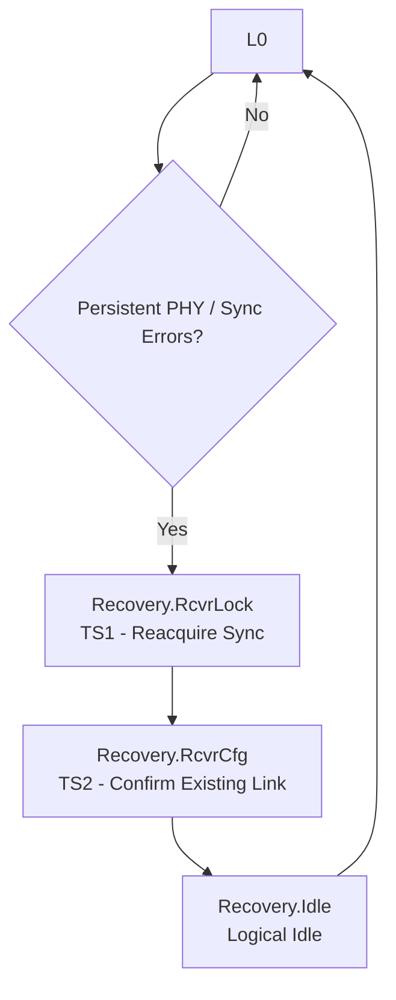
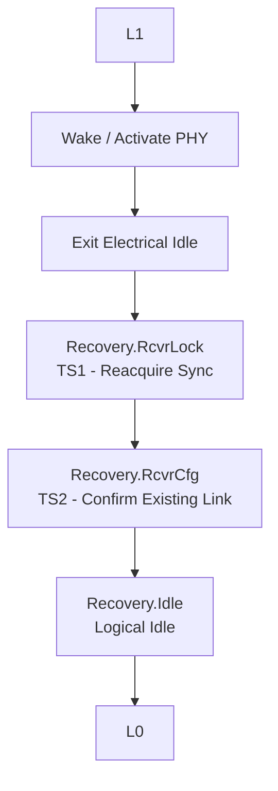
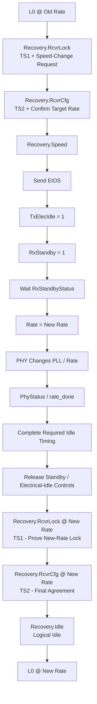

# PCIe LTSSM Recovery State — RTL Reference Manual

**Document type:** Project architecture / RTL implementation specification  
**Audience:** PCIe RTL, verification, PHY-wrapper, and integration engineers  
**Target implementation:** PCIe Gen1 / Gen2, 8b/10b, single-lane (`x1`) project  
**Primary scope:** LTSSM Recovery behavior, PIPE/PHY interaction, same-rate retraining, L1 exit, and Gen1↔Gen2 speed change  
**Status:** Project standard

---

## 1. Purpose

This document defines the project-standard behavior of the PCIe LTSSM `Recovery` state for the Gen1/Gen2 RTL implementation.

Recovery is used when the link configuration is already known, but the link must re-establish reliable communication before returning to `L0`. Recovery is **not only a speed-change mechanism**.

The design shall use Recovery for the following project use cases:

1. Same-rate retraining after loss of reliable receive synchronization while in `L0`.
2. Return from `L1` to `L0` at the existing data rate.
3. Directed data-rate change, for example Gen1 `2.5 GT/s` to Gen2 `5.0 GT/s`.
4. Recovery/fallback after an attempted higher-rate transition fails.

The implementation shall retain the already configured Link/Lane information during Recovery rather than restarting the full Detect → Polling → Configuration sequence unless a separate fatal/link-down condition requires it.

---

## 2. Normative Language

The following terms are used as implementation requirements:

- **SHALL** — mandatory project behavior.
- **SHOULD** — strongly recommended unless there is a documented architectural reason not to follow it.
- **MAY** — optional implementation choice.

---

## 3. Supported Recovery Substates

For this Gen1/Gen2 project, the LTSSM shall implement exactly these Recovery substates:

```text
RECOVERY_RCVRLOCK
RECOVERY_RCVRCFG
RECOVERY_SPEED
RECOVERY_IDLE
```

`Recovery.Equalization` shall **not** be implemented for the Gen1/Gen2 path. Equalization is associated with later PCIe generations operating at 8.0 GT/s and above.

For the current `x1` implementation, lane-to-lane deskew behavior is not required.

---

## 4. Recovery at a Glance

### 4.1 Same-rate Recovery

Used when the link must retrain but the operating rate does not change.

```text
L0
 ↓
Recovery.RcvrLock
 ↓
Recovery.RcvrCfg
 ↓
Recovery.Idle
 ↓
L0
```

`Recovery.Speed` is skipped.

### 4.2 L1 Exit to L0 at the Same Rate

```text
L1
 ↓
PHY returns to active operating condition
 ↓
Recovery.RcvrLock
 ↓
Recovery.RcvrCfg
 ↓
Recovery.Idle
 ↓
L0
```

`Recovery.Speed` is skipped because the data rate is unchanged.

### 4.3 Gen1 → Gen2 Speed Change

```text
L0 @ Gen1
 ↓
Recovery.RcvrLock        -- old rate
 ↓
Recovery.RcvrCfg         -- old rate
 ↓
Recovery.Speed
 ↓
Recovery.RcvrLock        -- new rate
 ↓
Recovery.RcvrCfg         -- new rate
 ↓
Recovery.Idle
 ↓
L0 @ Gen2
```

The second pass through `RcvrLock` and `RcvrCfg` is mandatory in the project architecture because the first pass negotiates the change, while the second pass proves that the link works at the new rate.

---

## 5. Why Recovery Exists

Recovery shall be understood as:

> The link topology and configuration are already known. Stop normal traffic, re-establish the physical/link synchronization that is needed, optionally change the operating rate, verify both directions, and return to `L0`.

Recovery shall not be interpreted as:

> Always change speed.

A speed change is only one possible Recovery use case.

---

## 6. Typical Conditions That Enter Recovery

### 6.1 Same-Rate Retraining from L0

If the link is in `L0` and the receive path is no longer considered reliable, the LTSSM may enter Recovery at the same operating rate.

Examples of project-level symptoms include:

- persistent 8b/10b decode errors;
- persistent disparity errors;
- repeated invalid receive indications;
- inability to identify valid protocol symbols/ordered sets;
- a PHY-specific indication that the receive path is no longer trustworthy.

The implementation should **not** enter Recovery because of one isolated symbol or packet error. Packet corruption that can be handled by the Data Link Layer should remain a Data Link Layer problem.

The project should use a configurable error persistence policy, for example an error counter or error-window threshold, before asserting a Recovery request.

Conceptually:

```text
L0
 ↓
Persistent PHY/synchronization errors
 ↓
Recovery.RcvrLock
 ↓
Recovery.RcvrCfg
 ↓
Recovery.Idle
 ↓
L0
```

### 6.2 Return from L1

When returning from `L1`, the PHY shall first be returned from its low-power condition to the active condition required for Recovery training.

Important implementation rule:

> Deasserting `TxElecIdle` is not itself the mechanism that powers up the transmitter circuitry.

PHY power-state control is responsible for restoring the required transmitter/receiver/clock circuitry. `TxElecIdle` controls electrical signaling behavior after the PHY is capable of operating.

Once the PHY is ready, the LTSSM shall use the same-rate Recovery path:

```text
L1
 ↓
PHY wake / active condition
 ↓
Recovery.RcvrLock
 ↓
Recovery.RcvrCfg
 ↓
Recovery.Idle
 ↓
L0
```

### 6.3 Directed Speed Change

For a directed Gen1 → Gen2 transition, the LTSSM shall enter Recovery and coordinate the rate change with the link partner before changing the local PHY rate.

### 6.4 Failed Higher-Speed Training

If the PHY locally changes to the new rate but the link cannot obtain valid new-rate training, the Recovery logic shall support fallback to the previously working rate.

The implementation should retain enough state to distinguish:

```text
original_rate
target_rate
changed_speed_recovery
```

---

## 7. Recovery.RcvrLock

### 7.1 Objective

The primary question in `Recovery.RcvrLock` is:

```text
"Can I reliably receive training sequences from the other side?"
```

For Gen1/Gen2, valid received training Ordered Sets provide protocol-level evidence that the following receive chain is functioning:

```text
analog signal reception
 ↓
CDR / bit lock
 ↓
10-bit symbol boundary
 ↓
8b/10b decoding
 ↓
COM recognition
 ↓
TS1 / TS2 Ordered Set recognition
```

The LTSSM does not require a raw `cdr_locked` signal if the PHY/MAC interface already provides sufficient evidence through valid received symbols/training sequences.

### 7.2 Transmit Behavior

In `Recovery.RcvrLock`, the transmitter shall transmit TS1 Ordered Sets continuously on every configured lane, subject to the ordered-set insertion requirements of the target PCIe generation.

For the current `x1` implementation:

```text
LTSSM
  ↓  request TS1
Ordered-Set Generator
  ↓
PIPE TxData / TxDataK
  ↓
PHY
```

### 7.3 Receive Behavior

The receiver shall validate qualifying TS1/TS2 Ordered Sets using the relevant training fields, including configured Link/Lane information and data-rate/training-control information.

The project shall maintain a valid-training counter.

Example conceptual implementation:

```text
valid_training_os_count
0
1
2
...
8
 ↓
receiver training considered established
 ↓
Recovery.RcvrCfg
```

The exact qualification rules shall follow the project's PCIe 2.x training decoder.

### 7.4 Role During Speed Change — First Pass

On the first visit to `RcvrLock` during a speed change:

```text
Current rate = old rate
```

The state has two jobs:

1. Prove the existing old-rate receive path is working.
2. Propagate/observe the speed-change request through training sequences.

The initiating component already knows it wants a speed change. The responding component learns the request through received training Ordered Sets.

### 7.5 Role During Speed Change — Second Pass

After `Recovery.Speed` completes, the LTSSM returns to `Recovery.RcvrLock` at the new rate.

The question is now:

```text
"Can we actually communicate at the new rate?"
```

This second pass is the protocol proof that the new-rate serial link works.

Important distinction:

```text
PhyStatus / rate_done
    = local PHY rate-change operation completed

valid TS1 at new rate
    = actual link is functioning at the new rate
```

---

## 8. Recovery.RcvrCfg

### 8.1 Objective

The simplified distinction is:

```text
RcvrLock:
"Can we hear each other?"

RcvrCfg:
"Do we agree on the existing/final link parameters and what happens next?"
```

### 8.2 Transmit Behavior

In `Recovery.RcvrCfg`, the transmitter shall send TS2 Ordered Sets on configured lanes using the already established Link/Lane configuration.

### 8.3 First Pass During Speed Change

During the first `RcvrCfg` visit at the old rate, the LTSSM shall use the received training information to determine whether the requested speed change can proceed.

Conceptually:

```text
Local supported rates:   Gen1 + Gen2
Remote supported rates:  Gen1 + Gen2
Highest common target:   Gen2
```

The LTSSM should track:

```text
successful_speed_negotiation
```

If a valid speed change is successfully negotiated:

```text
Recovery.RcvrCfg
 ↓
Recovery.Speed
```

If no speed change is required:

```text
Recovery.RcvrCfg
 ↓
Recovery.Idle
```

### 8.4 Second Pass After Speed Change

After new-rate `RcvrLock` succeeds, the LTSSM enters `RcvrCfg` again at the new rate.

At this point:

```text
speed_change = 0
```

because the physical rate transition has already occurred.

This second `RcvrCfg` shall perform the final TS2 handshake at the new rate before entering `Recovery.Idle`.

It shall not be described merely as "acknowledging lock." `RcvrLock` proves synchronization; `RcvrCfg` completes the final configuration/training agreement.

---

## 9. Recovery.Speed

### 9.1 Objective

`Recovery.Speed` is the only Recovery substate in this project that performs the actual physical data-rate transition.

Example:

```text
2.5 GT/s → 5.0 GT/s
```

The rate does **not** physically change in `RcvrLock` or `RcvrCfg`.

### 9.2 Required High-Level Sequence

The project sequence shall be:

```text
Recovery.RcvrCfg
 ↓
speed change successfully negotiated
 ↓
Recovery.Speed
 ↓
send EIOS
 ↓
Tx enters Electrical Idle
 ↓
confirm remote side has stopped old-rate signaling
 ↓
request RX standby
 ↓
wait for RxStandbyStatus
 ↓
request new Rate
 ↓
PHY changes PLL / serializer / RX operating range / clocking
 ↓
wait for PhyStatus / rate_done
 ↓
satisfy required Recovery.Speed idle timing
 ↓
release temporary speed-change controls
 ↓
Recovery.RcvrLock at new rate
```

### 9.3 EIOS and Electrical Idle

Before entering Electrical Idle, the MAC shall cause the ordered-set generator to transmit EIOS.

Conceptually:

```text
TS2 TS2 TS2 ...
 ↓
EIOS
 ↓
TxElecIdle = 1
 ↓
Electrical Idle
```

The transmitter shall not change frequency while the link partner is still actively transmitting at the old rate.

Both directions must converge to the safe old-rate idle condition before the rate switch is performed.

### 9.4 TxElecIdle

`TxElecIdle` is a transmitter control.

```text
TxElecIdle = 0
    → transmitter actively drives normal serial signaling

TxElecIdle = 1
    → transmitter enters Electrical Idle
```

Its role during `Recovery.Speed` is:

> Stop old-rate active serial signaling before the PHY operating rate is changed.

### 9.5 RxStandby

`RxStandby` is a receiver-side control.

Its role during `Recovery.Speed` is:

> Place the receive path into the PHY-defined standby condition required before the rate transition.

The LTSSM/PIPE wrapper shall not assume standby is instantaneous.

Required handshake:

```text
RxStandby = 1
 ↓
PHY places RX into standby
 ↓
RxStandbyStatus = 1
 ↓
LTSSM/PIPE may proceed with the rate request
```

### 9.6 Rate Request

Once the required transmitter-idle and receiver-standby conditions are satisfied, the MAC shall request the target rate.

Conceptually:

```text
LTSSM
Recovery.Speed
  ↓
mac_rate = target_rate
  ↓
PIPE Wrapper
  ↓
Rate = target_rate
  ↓
PHY
```

### 9.7 PHY Operation

The PHY performs the actual implementation-specific transition, which may include:

```text
reconfigure TX PLL
 ↓
change serializer frequency
 ↓
configure target-rate TX characteristics
 ↓
configure RX/CDR operating range
 ↓
update/generate target-rate PCLK
```

For the project's 8-bit PIPE example:

```text
Gen1:
serial rate = 2.5 GT/s
PCLK ≈ 250 MHz

Gen2:
serial rate = 5.0 GT/s
PCLK ≈ 500 MHz
```

### 9.8 Completion

When the PHY finishes the local rate operation, it shall report completion using the appropriate PIPE/PHY completion indication.

Project abstraction:

```text
PhyStatus = 1
 ↓
rate_done = 1
```

`rate_done` shall **not** be interpreted as proof that the remote PCIe link has trained successfully at the new rate.

The LTSSM shall still return to `Recovery.RcvrLock` and receive valid training at the new rate.

### 9.9 Electrical Idle Timing

The LTSSM shall satisfy the applicable PCIe 2.x `Recovery.Speed` Electrical Idle timing requirements.

The design shall not assume:

```text
rate_done = 1
 → immediately transmit TS1 in the same instant
```

For successful Gen2-era speed negotiation, the reference behavior includes a minimum Electrical Idle interval of 800 ns. The RTL shall implement the timing requirement according to the project's selected PCIe revision and clocking architecture.

### 9.10 Leaving Recovery.Speed

After the local rate change completes and all required idle/timing conditions are met:

1. the LTSSM/PIPE control shall release `RxStandby` as required by the PHY interface;
2. the transmitter shall leave Electrical Idle at the correct protocol point;
3. the LTSSM shall enter `Recovery.RcvrLock` at the new rate;
4. TS1 training shall begin at the new rate.

---

## 10. Recovery.Idle

### 10.1 Objective

`Recovery.Idle` is the final handshake before returning to normal packet operation.

The transmitter sends **Logical Idle**.

### 10.2 Electrical Idle vs Logical Idle

These concepts shall not be confused.

```text
Electrical Idle
----------------
The transmitter is electrically idle.
Used during low-power/speed-transition behavior.

Logical Idle
------------
The PHY is actively signaling.
Clocking is active.
Idle data symbols are transmitted.
Used in Recovery.Idle before L0.
```

### 10.3 Transition to L0

Once the required transmitted and received Logical Idle conditions are satisfied:

```text
Recovery.Idle
 ↓
L0
```

Normal TLP/DLLP/SKP traffic may resume in `L0`.

---

## 11. Complete Project Flows

### 11.1 Loss of Synchronization in L0



Project interpretation:

```text
RcvrLock = re-establish reliable receive synchronization
RcvrCfg  = confirm the existing link/training configuration
Idle     = prove both ends are ready
L0       = resume normal traffic
```

### 11.2 L1 → L0 at Same Rate



`Recovery.Speed` is skipped.

### 11.3 Gen1 → Gen2 Speed Change



---

## 12. PIPE / PHY Signal Responsibilities

| Signal / Concept | Direction | Project Role in Recovery |
|---|---|---|
| `TxElecIdle` | MAC/PIPE → PHY | Put transmitter into Electrical Idle during the speed-transition sequence. |
| `RxStandby` | MAC/PIPE → PHY | Request receiver standby before rate change. |
| `RxStandbyStatus` | PHY → MAC/PIPE | Confirm receiver has entered standby and the rate operation may proceed. |
| `Rate` / `mac_rate` | MAC/PIPE → PHY | Request the target Gen1/Gen2 operating rate. |
| `PhyStatus` | PHY → MAC/PIPE | Indicate completion of the local PHY operation. |
| `rate_done` | PIPE wrapper → LTSSM | Project-level completion pulse/state derived from PHY completion. |
| `TxDeemph` / project de-emphasis control | MAC/PIPE → PHY | Configure the selected Gen2 transmitter de-emphasis behavior where required. |

Important separation of responsibilities:

```text
TxElecIdle
    = transmitter signaling control

RxStandby
    = receiver standby control

Rate
    = PHY data-rate selection

PhyStatus / rate_done
    = local PHY operation completion

RcvrLock training
    = protocol proof that the actual link works
```

---

## 13. Recommended LTSSM State Variables

The Recovery RTL should explicitly maintain the following state/configuration information.

### 13.1 `directed_speed_change`

Meaning:

```text
"Do we currently want to perform a protocol-coordinated speed change?"
```

### 13.2 `successful_speed_negotiation`

Meaning:

```text
"Did both sides successfully agree on a common target rate?"
```

### 13.3 `changed_speed_recovery`

Meaning:

```text
"Has the physical rate already been changed during this Recovery attempt?"
```

This variable is useful for distinguishing the first and second visits to `RcvrLock` / `RcvrCfg`.

### 13.4 `original_rate`

Stores the previously working rate for fallback.

### 13.5 `target_rate`

Stores the rate selected for the current speed-change attempt.

### 13.6 Training Counters

At minimum, the implementation should maintain counters equivalent to:

```text
valid_training_os_count
rx_ts2_count
logical_idle_count
```

and any transmit-side counters required by the selected PCIe revision.

---

## 14. Recommended RTL Transition Policy

### 14.1 RcvrLock

```text
Enter RcvrLock
 ↓
Transmit TS1
 ↓
Validate qualifying TS1/TS2
 ↓
Required training count reached?
  ├─ No  → remain RcvrLock
  └─ Yes → RcvrCfg
```

### 14.2 RcvrCfg

```text
Enter RcvrCfg
 ↓
Transmit TS2
 ↓
Required TS2 conditions satisfied?
  ├─ No → remain RcvrCfg
  └─ Yes
       ↓
       speed change successfully negotiated?
       ├─ Yes → Recovery.Speed
       └─ No  → Recovery.Idle
```

### 14.3 Recovery.Speed

```text
Enter Recovery.Speed
 ↓
Send EIOS
 ↓
Assert TxElecIdle
 ↓
Confirm safe receive-side/remote-idle condition
 ↓
Assert RxStandby
 ↓
Wait RxStandbyStatus
 ↓
Request target Rate
 ↓
Wait PhyStatus / rate_done
 ↓
Satisfy required idle timing
 ↓
Release temporary controls
 ↓
Recovery.RcvrLock @ target rate
```

### 14.4 Recovery.Idle

```text
Enter Recovery.Idle
 ↓
Transmit Logical Idle
 ↓
Receive required Logical Idle
 ↓
Meet transmit requirement
 ↓
L0
```

---

## 15. Speed-Change Failure / Fallback

If the PHY successfully completes the local rate change but the link cannot obtain valid new-rate training, the design shall not assume success.

Example failure path:

```text
Recovery.RcvrLock @ Gen2
 ↓
new-rate training fails / timeout
 ↓
Recovery.Speed
 ↓
Electrical Idle
 ↓
Rate = original_rate
 ↓
PHY returns to Gen1
 ↓
Recovery.RcvrLock @ Gen1
```

The RTL should use `original_rate`, `target_rate`, and `changed_speed_recovery` so that this sequence is explicit and reviewable.

---

## 16. Error Detection Policy in L0

The project shall separate ordinary packet corruption from receiver synchronization failure.

### 16.1 Do Not Immediately Enter Recovery For

```text
one isolated symbol error
one corrupted TLP
one LCRC failure that the Data Link Layer can replay
```

### 16.2 Recovery Request Should Be Based On

A persistent indication that the receive path is no longer trustworthy.

Recommended project abstraction:

```verilog
if (rx_serious_error)
    rx_error_count <= rx_error_count + 1;
else
    rx_error_count <= 0;

if (rx_error_count >= RECOVERY_ERROR_THRESHOLD)
    recovery_request <= 1'b1;
```

`RECOVERY_ERROR_THRESHOLD` shall be configurable and verified against the project's PHY error-reporting behavior.

The specific definition of `rx_serious_error` is PHY-wrapper dependent and may combine decode, disparity, validity, or PHY-specific receiver-status information.

---

## 17. L1 Exit Rules

For same-rate `L1 → L0`:

1. The PHY power state shall first be restored to the active state needed for training.
2. The transmitter shall leave Electrical Idle at the protocol-defined point.
3. The LTSSM shall enter `Recovery.RcvrLock`.
4. TS1 shall be used to re-establish/verify receiver synchronization.
5. `Recovery.RcvrCfg` shall exchange TS2 and confirm the existing link configuration.
6. `Recovery.Speed` shall be skipped because the rate is unchanged.
7. `Recovery.Idle` shall exchange Logical Idle.
8. The LTSSM shall return to `L0`.

Project shorthand:

```text
L1
 ↓
Wake PHY
 ↓
RcvrLock
 ↓
RcvrCfg
 ↓
Idle
 ↓
L0
```

---

## 18. State Responsibility Matrix

| Recovery State | LTSSM Responsibility | MAC Responsibility | PIPE Responsibility | PHY Responsibility |
|---|---|---|---|---|
| `RcvrLock` | Count/validate training, manage speed-change intent | Generate/detect TS1 | Normal symbol transport | CDR, bit/symbol recovery, SERDES |
| `RcvrCfg` | Confirm remote parameters; decide `Speed` vs `Idle` | Generate/detect TS2 | Normal symbol transport | Continue physical RX/TX |
| `Speed` | Coordinate EIOS, idle, standby, target rate, completion | Generate EIOS | `TxElecIdle`, `RxStandby`, `Rate`, `PhyStatus` handshake | Actually change PLL/PCLK/serial rate |
| `RcvrLock` second pass | Verify new rate works | TS1 at new rate | New-rate symbol transport | CDR locks to new-rate stream |
| `RcvrCfg` second pass | Final new-rate agreement | TS2 at new rate | New-rate symbol transport | Stable new-rate operation |
| `Idle` | Confirm readiness for operational state | Generate/detect Logical Idle | Normal datapath | Continue active signaling |
| `L0` | Operational link | TLP/DLLP/OS traffic | Normal PIPE transport | Normal serial link |

---

## 19. Required Design Invariants

The following invariants shall hold in RTL and should be checked using assertions.

### 19.1 Speed Change Safety

The PHY rate shall not be changed while old-rate active signaling is still being intentionally transmitted.

### 19.2 Standby Completion

The rate request shall not be issued before the required receiver-standby handshake is complete.

### 19.3 Local PHY Completion Is Not Link Completion

`PhyStatus` / `rate_done` shall not cause direct transition to `L0`.

After a rate change, the next training state shall be `Recovery.RcvrLock` at the new rate.

### 19.4 Second Pass Is Mandatory After Speed Change

```text
Recovery.Speed
 ↓
Recovery.RcvrLock
 ↓
Recovery.RcvrCfg
```

shall occur before `Recovery.Idle` and `L0`.

### 19.5 Same-Rate Recovery Skips Speed

For same-rate retraining and normal same-rate L1 exit:

```text
Recovery.RcvrCfg
 ↓
Recovery.Idle
```

`Recovery.Speed` shall not be entered unless a valid speed-change operation is required.

### 19.6 Electrical Idle and Logical Idle Must Remain Distinct

The RTL, signal names, comments, and verification sequences shall not use these terms interchangeably.

---

## 20. Suggested Assertions / Verification Checks

The verification environment should include checks equivalent to the following:

1. `RECOVERY_SPEED` cannot be entered unless speed negotiation/request conditions are valid.
2. EIOS is generated before transmitter Electrical Idle for the speed-transition path.
3. `Rate` does not change until the required idle/standby conditions are met.
4. `Rate` remains stable while the PHY rate operation is in progress unless explicitly allowed by the PIPE implementation.
5. `rate_done` after a speed change leads to `RECOVERY_RCVRLOCK`, not directly to `RECOVERY_IDLE` or `L0`.
6. TS1 is transmitted in `RECOVERY_RCVRLOCK`.
7. TS2 is transmitted in `RECOVERY_RCVRCFG`.
8. Logical Idle is transmitted in `RECOVERY_IDLE`.
9. Same-rate Recovery does not enter `RECOVERY_SPEED`.
10. A successful speed change performs a second `RcvrLock` and `RcvrCfg` pass at the new rate.
11. If new-rate training times out, the fallback path can restore `original_rate`.
12. `L0` cannot be entered until the required Recovery.Idle conditions are satisfied.

---

## 21. Implementation Guidance for This Project

The Recovery controller should be partitioned into three logical pieces:

### 21.1 LTSSM Control

Responsible for:

```text
state transitions
training counters
timeouts
speed-change intent
rate selection
fallback decision
```

### 21.2 Ordered-Set Generator / Detector

Responsible for:

```text
TS1 generation/detection
TS2 generation/detection
EIOS generation
Logical Idle generation/detection
training-field extraction
```

### 21.3 PIPE Operation Controller

Responsible for safely sequencing:

```text
TxElecIdle
RxStandby
RxStandbyStatus
Rate
PhyStatus
rate_done
TxDeemph where applicable
```

The LTSSM should request operations at a semantic level and avoid embedding PHY-specific timing details that belong in the PIPE wrapper.

---

## 22. Simplified Mental Model for the Team

### Same-Rate Recovery

```text
RcvrLock
    = Get synchronization back.

RcvrCfg
    = Confirm the existing link.

Idle
    = Confirm both sides are ready.

L0
    = Resume packets.
```

### Speed Change

```text
RcvrLock @ old rate
    = We can communicate; request/observe speed change.

RcvrCfg @ old rate
    = Agree on the target rate.

Recovery.Speed
    = Stop TX safely, prepare RX, change PHY rate.

RcvrLock @ new rate
    = Prove communication works at the new rate.

RcvrCfg @ new rate
    = Final agreement at the new rate.

Recovery.Idle
    = Both sides ready.

L0 @ new rate
    = Resume normal traffic.
```

### PIPE Control Memory Aid

```text
TxElecIdle
    = "Stop talking."

RxStandby
    = "Prepare my receiver for the rate change."

Rate
    = "Switch the PHY operating rate."

PhyStatus / rate_done
    = "My local PHY finished the operation."

Recovery.RcvrLock
    = "Now prove the actual link works."
```

---

## 23. Final Project Rules

1. Recovery is a **retraining/re-synchronization state**, not only a speed-change state.
2. Same-rate recovery uses `RcvrLock → RcvrCfg → Idle`.
3. Normal Gen1/Gen2 L1 exit at the same rate uses `RcvrLock → RcvrCfg → Idle` after PHY wake-up.
4. A speed change uses `RcvrLock → RcvrCfg → Speed → RcvrLock → RcvrCfg → Idle`.
5. `Recovery.Speed` owns the project-level coordination of EIOS, Electrical Idle, RX standby, target rate, and PHY-completion handshake.
6. `TxElecIdle` controls transmitter Electrical Idle; it does not itself power up/down the PHY.
7. `RxStandby` prepares/parks the receive path for the rate operation and requires confirmation through `RxStandbyStatus` when supported by the interface.
8. `PhyStatus` / `rate_done` proves only that the **local PHY operation completed**.
9. New-rate TS1 training in `RcvrLock` proves that the actual PCIe link works at the new speed.
10. `RcvrCfg` performs the TS2-based configuration/final-agreement handshake; it is not merely an acknowledgment of CDR lock.
11. `Recovery.Idle` uses **Logical Idle**, which is different from **Electrical Idle**.
12. The project shall not implement `Recovery.Equalization` for Gen1/Gen2.
13. Persistent PHY/synchronization errors may request same-rate Recovery; isolated packet errors should not automatically do so.
14. A failed higher-speed attempt shall support fallback to the previously working rate.

---

## 24. Canonical State Paths

```text
Same-rate retraining from L0:
L0 → RcvrLock → RcvrCfg → Idle → L0

L1 exit at same rate:
L1 → PHY Wake → RcvrLock → RcvrCfg → Idle → L0

Gen1 → Gen2 speed change:
L0 → RcvrLock → RcvrCfg → Speed → RcvrLock → RcvrCfg → Idle → L0

Failed Gen2 training fallback:
RcvrLock @ Gen2 → Speed → RcvrLock @ Gen1 → RcvrCfg → Idle → L0
```

---

## 25. Reference Basis

This project manual is based on the team's PCIe 2.x Recovery reference notes and the agreed Gen1/Gen2 RTL architecture discussed during design review. Where PHY power sequencing or PIPE signal timing is implementation-specific, this document defines the project abstraction and requires the PHY wrapper to map that abstraction to the selected PHY/PIPE implementation.

