# Chapter 1 — Positions of PIPE Interface in a Complete PCIe System

## Introduction

PCIe consists of multiple Subsystems viz. 

- Transaction Layer
- Data Link Layer
- LTSSM
- Ordered-set generator
- Scrambler
- 8b/10b encoder
- Serializer and deserializer
- Electrical transmitter and receiver


> **PIPE is a standardized interface between the digital PCIe controller and the high-speed PCIe PHY.**

PIPE does not create TLPs, calculate LCRC, scramble bytes, encode symbols, or serialize data. It defines how the controller and PHY exchange parallel data, commands, clocks, and status.

This chapter develops that answer gradually. By the end, you should be able to look at a PCIe block diagram and identify where PIPE belongs, what crosses it, and which functions remain on each side.

---

## 1. The complete PCIe path

At a high level, a PCIe device contains three protocol layers:

1. Transaction Layer
2. Data Link Layer
3. Physical Layer

The Physical Layer is then divided into logical/digital functions and electrical/high-speed functions.

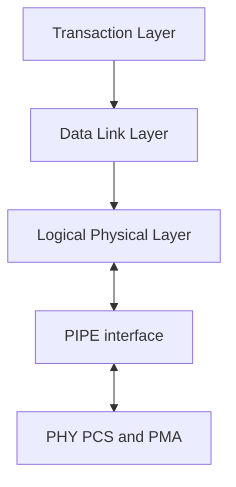

On transmission, information moves from top to bottom. On reception, it moves from bottom to top.

### 1.1 Transaction Layer

The Transaction Layer creates and consumes **Transaction Layer Packets**, or TLPs.

Examples include:

- Memory Read Request
- Memory Write Request
- Configuration Read or Write
- Completion with or without data
- Messages

For a Memory Write, the Transaction Layer determines information such as:

- Destination address
- Payload data
- Requester identity
- Traffic class and attributes

At this point, the information is still a PCIe transaction. It is not yet a high-speed serial signal.

### 1.2 Data Link Layer

The Data Link Layer makes delivery across one PCIe link reliable.

For a transmitted TLP, it manages functions such as:

- Sequence numbering
- Link CRC, or LCRC
- ACK and NAK handling
- Replay of unacknowledged TLPs
- Link-level flow-control credits

It also creates **Data Link Layer Packets**, or DLLPs. Examples include ACK, NAK, and flow-control update DLLPs.

Therefore, two important streams can move toward the Physical Layer:

- TLP-related traffic
- DLLPs generated by the Data Link Layer

### 1.3 Logical Physical Layer

The Logical Physical Layer is the digital, protocol-aware part of the Physical Layer. Depending on the implementation and PIPE architecture, it commonly contains functions such as:

- Link Training and Status State Machine, or LTSSM
- Packet framing
- Ordered-set generation and checking
- Selection between packet traffic and ordered sets
- Lane distribution and lane-to-lane management
- Scrambling and descrambling
- Decisions about rate, power state, electrical idle, polarity, and loopback

It does not directly drive the differential PCIe pins.

### 1.4 PHY PCS and PMA

The external or hard PHY contains the high-speed datapath.

In a conventional Gen1/Gen2 PIPE PHY, its functions commonly include:

- 8b/10b encoding and decoding
- Elastic buffering
- Clock compensation reporting
- Receiver detection
- Parallel-to-serial and serial-to-parallel conversion
- Clock generation and clock-data recovery
- Electrical transmit and receive circuitry

The PMA ultimately connects to:

- `TX+` and `TX−`
- `RX+` and `RX−`

---

## 2. Why PIPE exists

Imagine that every PCIe controller vendor used a different interface to every PHY vendor. Integrating a controller and PHY would require a custom bridge for each combination.

PIPE solves this problem by defining an agreed controller-to-PHY contract.

It specifies signals for:

- Transmit and receive data
- Data/control-character indication
- Clocking
- Electrical idle
- Power-state requests
- Signalling-rate changes
- Receiver detection
- Loopback
- PHY completion and receive status

This gives SoC designers a standard integration boundary.

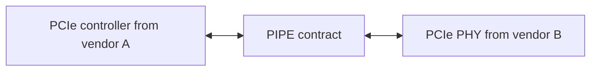

The benefit is interoperability. A controller does not need to know how the PHY implements its PLL, CDR, serializer, analog equalizer, or differential driver. The PHY does not need to know how the controller stores TLPs or implements its replay buffer.

The official PIPE specification describes this as an interface between a PHY and the MAC/Link Layer ASIC. In PIPE terminology, **MAC** broadly means the controller-side logic; it is not a separate PCIe architectural layer in the same sense as the Transaction or Data Link Layer.

---

## 3. PIPE is not a processing block

This is the most important idea in the chapter.

> **PIPE is an interface specification, not an algorithm that converts packets.**

Consider AXI. AXI defines how a master and slave exchange addresses, data, and responses. AXI itself does not calculate the address or process the data.

PIPE works similarly. The producer must place correctly defined information on the PIPE signals. The receiver interprets those signals according to the PIPE contract.

For a conventional one-lane, 8-bit Gen1/Gen2 interface, important transmit signals include:

```verilog
TxData[7:0]
TxDataK
TxElecIdle
TxCompliance
```

Important receive signals include:

```verilog
RxData[7:0]
RxDataK
RxValid
RxStatus[2:0]
RxElecIdle
```

Control and handshake signals include examples such as:

```verilog
Rate
PowerDown[1:0]
TxDetectRx
PhyStatus
RxPolarity
```

PIPE therefore carries three categories of information:

| Category | Examples | Purpose |
|---|---|---|
| Data | `TxData`, `TxDataK`, `RxData`, `RxDataK` | Exchange parallel characters |
| Commands | `Rate`, `PowerDown`, `TxElecIdle`, `TxDetectRx` | Request PHY operations |
| Status | `PhyStatus`, `RxStatus`, `RxValid`, `RxElecIdle` | Report PHY results and receive conditions |

---

## 4. What happens before PIPE?

Let us use the **Original PIPE architecture for PCIe Gen1/Gen2**, because that matches an 8-bit `TxData` interface with `TxDataK` and PHY-generated `PCLK`.

On the transmit side, the controller can have several sources of information:

- TLP/DLLP packet stream
- Training sequences such as TS1 and TS2
- SKP ordered sets
- Electrical-idle-related sequences
- Compliance or loopback patterns

A MUX selects which source is allowed to transmit.

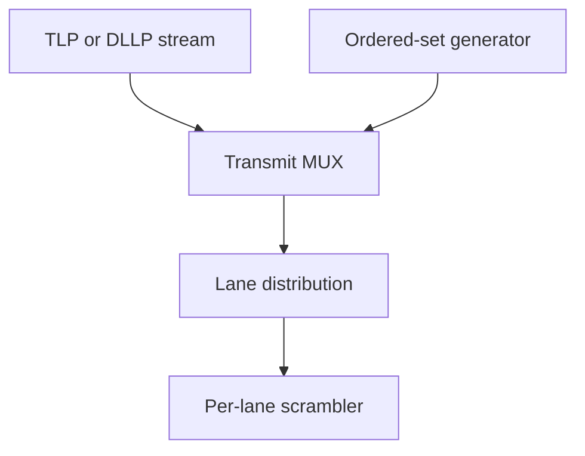

The MUX does not generate the data. It selects data generated by other blocks.

After selection, lane logic arranges the characters for the active lane or lanes. A per-lane scrambler then applies the PCIe scrambling rules.

At this stage, each lane has a parallel character and an indication of whether it is a normal data character or a special control character.

That character stream is ready to cross the Original PIPE boundary.

---

## 5. Where exactly is Original PIPE placed?

For the conventional Gen1/Gen2 Original PIPE partition, the transmit boundary is normally:

> **After the controller-side scrambler and before the PHY-side 8b/10b encoder.**

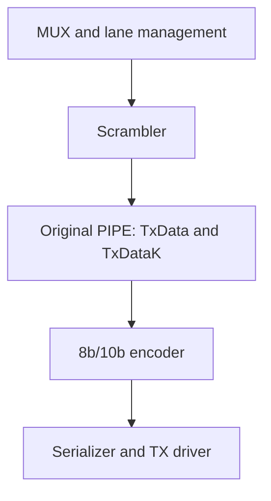

The receive path is the reverse:

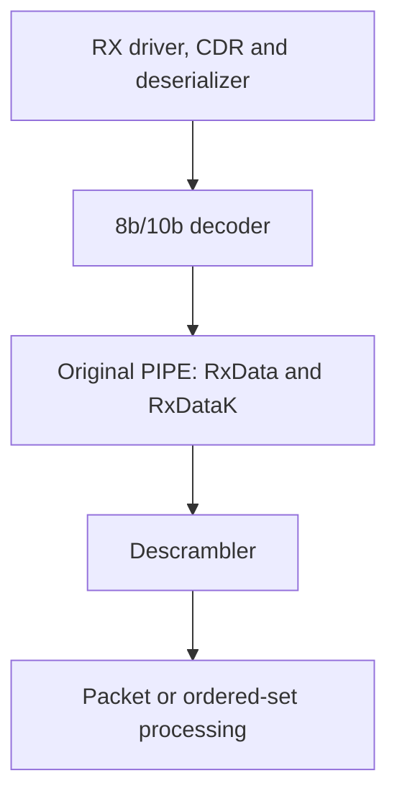

This is the most useful placement to remember for the module studied in this book.

### 5.1 Why `DataK` crosses PIPE

For Gen1/Gen2, an 8-bit character can represent either:

- A normal data character
- A special K-control character

`TxDataK` tells the PHY encoder which kind of character is present.

```text
TxDataK = 0: encode TxData as a data character
TxDataK = 1: encode TxData as a K-control character
```

`TxDataK` does **not** directly identify TLP, DLLP, or ordered set.

The sequence of data and control characters identifies the stream. For example, framing/control symbols help the receiving logical layer distinguish packet and ordered-set traffic.

---

## 6. Why is the scrambler before Original PIPE?

The scrambler is easier to understand if we avoid calling it a packet parser. It does not inspect a Memory Write address or interpret a TLP header.

It is a stateful character-stream operation.

For a normal data character, it combines the input with a pseudo-random sequence produced by an LFSR. The corresponding receiver uses the same sequence to recover the original value.

Conceptually:

```text
Original character XOR current LFSR mask = scrambled character
Scrambled character XOR same LFSR mask  = original character
```

The logic must also follow PCIe rules about when characters are processed, bypassed, or used to synchronize the scrambler state. It therefore works naturally near the ordered-set, `DataK`, lane, and LTSSM-related control logic.

### 6.1 A small character example

Assume the selected transmit stream contains:

| Character | `DataK` | Meaning |
|---|---:|---|
| COM | 1 | Control character |
| `0x12` | 0 | Normal data character |
| `0x34` | 0 | Normal data character |

Suppose the scrambler produces `0xA7` and `0x4C` for the two data characters. The Original PIPE interface carries:

| PCLK cycle | `TxData` | `TxDataK` |
|---:|---:|---:|
| 1 | COM value | 1 |
| 2 | `0xA7` | 0 |
| 3 | `0x4C` | 0 |

The PHY then applies 8b/10b encoding to each character and serializes the resulting 10-bit symbols.

On reception, the PHY decodes the 10-bit symbols and returns `0xA7` and `0x4C` through `RxData`. The controller-side descrambler reconstructs `0x12` and `0x34`.

---

## 7. Can a vendor move the scrambler into the PHY?

Yes, as an implementation choice in a tightly integrated or custom design—but this changes the functional contract at that internal boundary.

Consider two architectures.

### 7.1 Standard Original PIPE partition

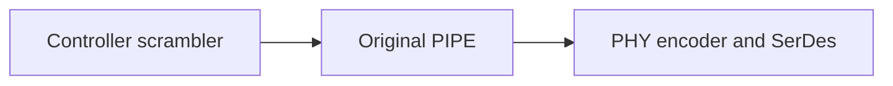

Here, `TxData` means an already-scrambled parallel character.

### 7.2 Custom controller–PHY partition

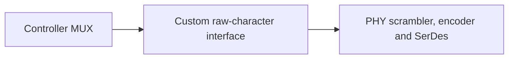

Here, the crossing data is unscrambled. This design can work if both sides agree about:

- What is scrambled or bypassed
- LFSR reset, advance, and synchronization behavior
- Per-lane state
- Scrambler enable/disable conditions
- Matching receive-side descrambling

The wires might resemble `TxData` and `TxDataK`, but the meaning of the data has changed. It should not automatically be assumed plug-compatible with a commercial Original PIPE PHY.

The key principle is:

> Vendors may move internal blocks when they control both sides, but a standardized interface remains interoperable only when both sides obey the same published contract.

---

## 8. Original PIPE versus modern PIPE SerDes architecture

There is not one universal PIPE datapath partition for every generation and architecture.

### 8.1 Original PIPE

Original PIPE commonly uses 8-, 16-, or 32-bit data widths. In Gen1/Gen2 mode, the PHY receives data characters plus `TxDataK` and performs 8b/10b encoding.

This is the architecture assumed by an interface containing signals such as:

```verilog
TxData[7:0]
TxDataK
RxData[7:0]
RxDataK
PhyStatus
```

### 8.2 PIPE SerDes architecture

Later PIPE specifications introduced a SerDes architecture that moves more protocol-specific digital processing into the controller. For example, 8b/10b or 128b/130b encoding/decoding can be controller-side, while the PHY becomes closer to a protocol-independent serializer/deserializer.

That architecture can use data widths based on 10-bit multiples rather than the Original PIPE 8/16/32-bit character interface.

Therefore, when studying a commercial IP, always ask:

1. Which PIPE specification version is supported?
2. Is it Original PIPE or PIPE SerDes architecture?
3. What is the PIPE data width?
4. Does the PHY expect encoded or unencoded data?
5. Which side owns the scrambler, encoder, elastic buffer, and loopback?

Signal names alone are not enough; the selected architecture and vendor documentation define their meaning.

---

## 9. Mapping PIPE onto a commercial PCIe system

A commercial PCIe solution often consists of a digital controller IP and a hard mixed-signal PHY IP.

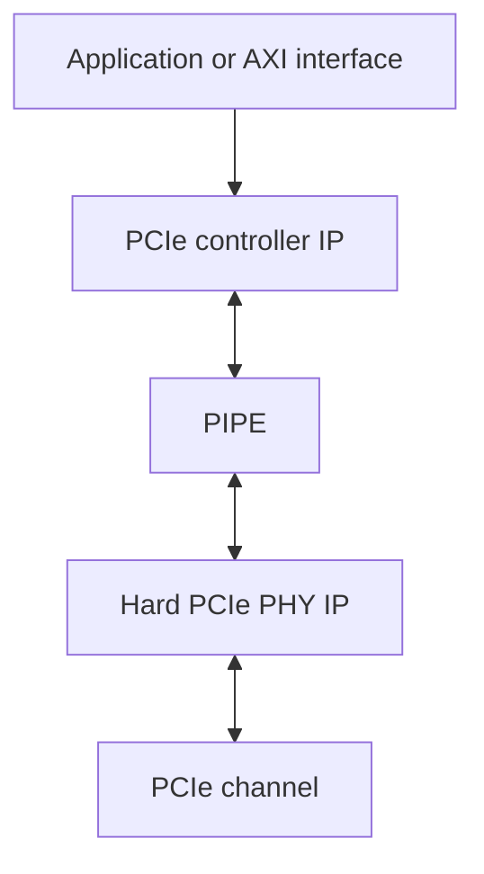

The controller IP commonly contains:

- Transaction Layer
- Data Link Layer
- Logical Physical Layer
- LTSSM
- Ordered-set logic
- PIPE control logic

The hard PHY commonly contains:

- PCS functions assigned to the selected PIPE architecture
- PMA serializer/deserializer
- PLL and CDR
- Analog equalization
- Differential drivers and receivers

Public documentation from Synopsys and Cadence describes controller IP connecting to separate PIPE-compliant PHY IP. Intel/Altera transceiver documentation similarly exposes a PIPE mode while implementing the associated transceiver PCS/PMA operations.

This controller/PHY separation is the practical commercial use of PIPE.

---

## 10. Mapping the `pcie_pipe_mac_if_v3` module

The module studied in this book is not the complete PIPE PHY and not the complete PCIe controller. It is a controller-side wrapper for a reduced, one-lane Gen1/Gen2 Original PIPE interface.

Its placement is:

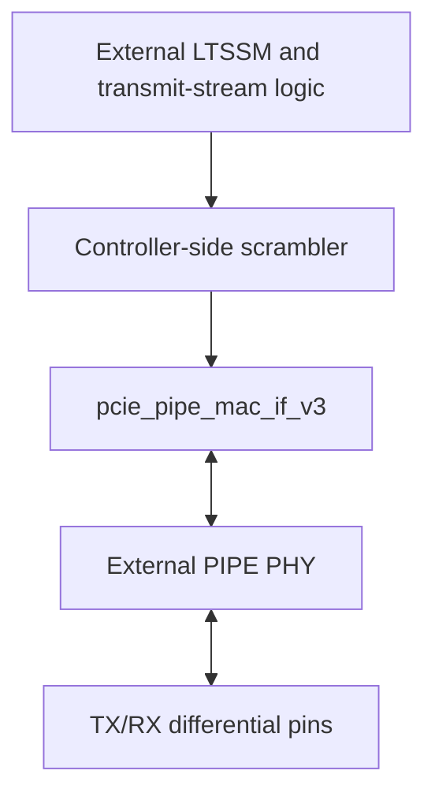

### 10.1 Transmit data behavior

The wrapper registers or safely suppresses the prepared stream:

```verilog
if (effective_tx_idle) begin
    TxData  <= 8'h00;
    TxDataK <= 1'b0;
end else begin
    TxData  <= mac_tx_data;
    TxDataK <= mac_tx_datak;
end
```

There is no scrambler or encoder in this block. For the Original PIPE partition, `mac_tx_data` should therefore represent the prepared, post-scrambler character stream.

### 10.2 Receive data behavior

The receive data path is almost direct:

```verilog
assign mac_rx_data   = RxData;
assign mac_rx_datak  = RxDataK;
assign mac_rx_valid  = RxValid;
assign mac_rx_status = RxStatus;
```

The external PHY has already recovered and decoded the serial characters. An upstream controller-side descrambler and packet/ordered-set logic must process the returned character stream.

### 10.3 What the wrapper actually adds

The wrapper provides control and safety around the interface:

- Gen1/Gen2 rate-change request handling
- P0, P0s, and P1 power-state control
- Receiver detection
- Loopback control
- Electrical-idle enforcement
- PHY-operation priority
- `PhyStatus` completion handling
- Timeout protection
- `RxElecIdle` synchronization and filtering
- `RxStatus` decoding

It is better described as a **PIPE operation controller and datapath wrapper**, not as a packet converter.

---

## 11. A complete transmit example

Consider a Memory Write initiated by a processor.

### Step 1: Transaction creation

The Transaction Layer creates a Memory Write TLP containing the destination address and payload.

### Step 2: Link protection

The Data Link Layer assigns a sequence number and appends LCRC. It also manages replay until the packet is acknowledged.

### Step 3: Physical framing and source selection

The Logical Physical Layer forms the transmitted character sequence. If the link is in normal L0 operation and no higher-priority ordered set must be transmitted, the transmit MUX selects the packet stream.

### Step 4: Lane distribution and scrambling

The stream is distributed to the active lane or lanes and processed by the per-lane scrambler.

### Step 5: PIPE transfer

Each PCLK cycle carries one character per lane in an 8-bit configuration:

```verilog
TxData[7:0]
TxDataK
```

The wrapper also ensures that the PHY is in P0 and not forced into electrical idle.

### Step 6: PHY coding and electrical transmission

For Gen1/Gen2 Original PIPE, the PHY performs 8b/10b encoding. The PMA serializes the symbols and drives the differential channel.

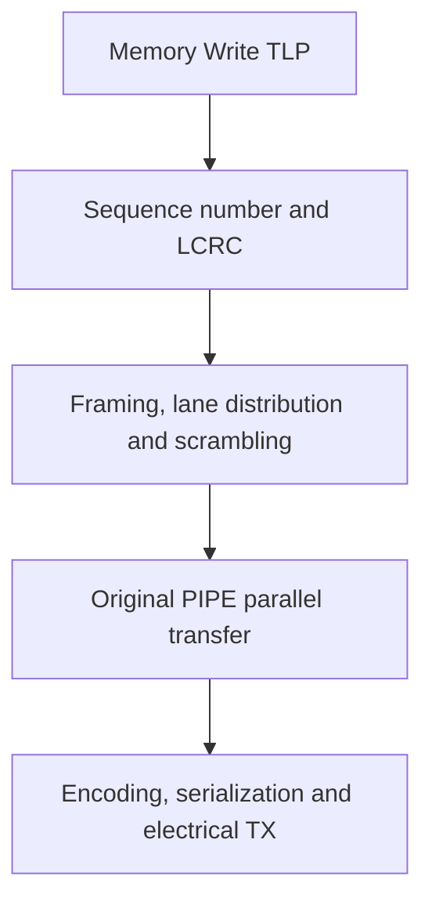

---

## 12. A complete receive example

Reception follows the reverse direction.

### Step 1: Electrical reception

The PHY receiver detects the differential signal. The CDR recovers timing and the deserializer creates parallel encoded symbols.

### Step 2: PHY decoding

For Gen1/Gen2, the PHY performs 8b/10b decoding and identifies data versus K-control characters.

### Step 3: PIPE transfer

The PHY reports characters through:

```verilog
RxData[7:0]
RxDataK
RxValid
RxStatus[2:0]
```

### Step 4: Controller-side recovery

The Logical Physical Layer descrambles the character stream, recognizes framing or ordered sets, and reconstructs packets.

### Step 5: Data Link and Transaction processing

For a TLP, the Data Link Layer checks sequence and LCRC. A valid packet is delivered to the Transaction Layer.

---

## 13. PIPE also controls the PHY

Focusing only on `TxData` and `RxData` misses half of PIPE’s value. The controller also needs to operate the PHY.

### 13.1 Rate change

The LTSSM decides that the link should change from Gen1 to Gen2. The wrapper drives the PIPE `Rate` request and waits for `PhyStatus`.

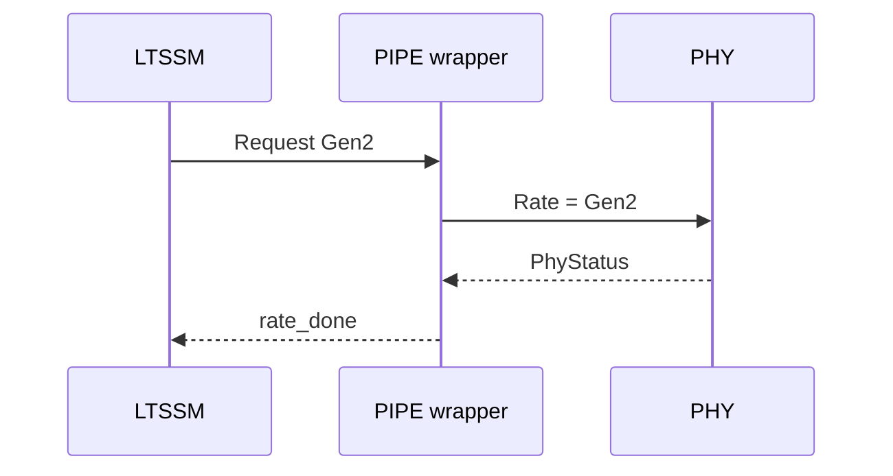

### 13.2 Receiver detection

During Detect, the LTSSM requests receiver detection. The wrapper ensures the PHY is in the required power state, asserts `TxDetectRx`, waits for `PhyStatus`, and interprets `RxStatus`.

### 13.3 Power management

The controller requests PIPE power states such as P0, P0s, or P1. The PHY performs the electrical transition and acknowledges completion.

These examples show why PIPE is more than a parallel data bus: it is the complete operational contract between controller and PHY.

---

## 14. Chapter summary

The complete PCIe transmit path can be summarized as:

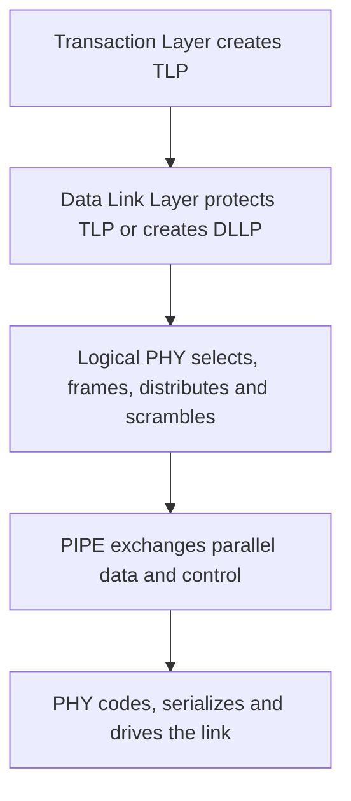

Conclusions:

1. PIPE is a controller-to-PHY interface, not a PCIe packet-processing layer.
2. The Transaction Layer creates TLPs.
3. The Data Link Layer protects TLPs and generates DLLPs.
4. The Logical Physical Layer manages LTSSM, ordered sets, stream selection, lane functions, and scrambling according to the selected architecture.
5. In Original Gen1/Gen2 PIPE, the boundary is normally after the scrambler and before the PHY’s 8b/10b encoder.
6. PIPE carries parallel characters, PHY commands, and PHY status.
7. The PHY performs the coding/electrical functions assigned by the selected PIPE architecture.
8. Vendors may use different internal partitions, but interoperability requires both sides to follow the same interface contract.
9. The `pcie_pipe_mac_if_v3` module is a small controller-side PIPE operation wrapper, not a complete controller, logical PHY, PCS, or PMA.

---

## References

- [Intel — PHY Interface for PCI Express, SATA, USB, DisplayPort, and Converged I/O Architectures, Version 5.1](https://www.intel.com/content/dam/www/public/us/en/documents/white-papers/phy-interface-pci-express-sata-usb30-architectures-3.1.pdf)
- [Intel/Altera — Transceiver Channel Datapath for PIPE](https://docs.altera.com/r/docs/683621/current/l-and-h-tile-transceiver-phy-user-guide/transceiver-channel-datapath-for-pipe)
- [Cadence — 10 Gbps Multi-Protocol PHY IP](https://www.cadence.com/en_US/home/resources/brochures/10gbps-multi-protocol-phy-ip-br.html)
- [Synopsys — DesignWare PCIe Controller and PIPE-compliant PHY integration](https://news.synopsys.com/home?item=122700)
- [Synopsys — Demystifying PCIe PIPE 5.1 SerDes Architecture](https://www.synopsys.com/blogs/chip-design/demystifying-pcie-pipe-serdes-architecture.html)

